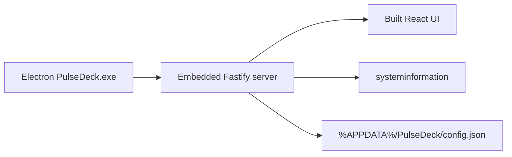

# PulseDeck

**Your Windows PC widget dashboard — as a real desktop app.**

Live CPU, RAM, GPU, disks, network, crypto, stocks, weather, and more in a beautiful drag-and-drop widget grid. Install once, launch from the Start menu. No browser. No terminal.

[](https://github.com/nrzz/pulsedeck/actions/workflows/ci.yml)
[](https://github.com/nrzz/pulsedeck/releases/latest)
[](LICENSE)


<p align="center"></p>

---

## Download & install (end users)

**This is the path for most people.** You do not need Node.js.

1. Open the latest release:  
   **https://github.com/nrzz/pulsedeck/releases/latest**
2. Download **`PulseDeck-Setup-x.x.x.exe`**
3. Run the installer
   - If Windows SmartScreen appears: click **More info** → **Run anyway**  
     (the installer is open-source but not code-signed — signing certificates cost money)
4. Launch **PulseDeck** from the Start menu or desktop shortcut
5. The floating widget board opens on your desktop (wallpaper shows between cards)

**That’s it.** Closing the board hides to the system tray. **Ctrl+Alt+P** toggles visibility. Right-click the tray icon → **Quit** to fully exit.

Full install help: [docs/INSTALL.md](docs/INSTALL.md)

### Local installer (if you built from source)

After `npm run dist`, the installer is at:

```
apps/desktop/release/PulseDeck-Setup-1.0.0.exe
```

---

## Features

| Area                | What you get                                                                |
| ------------------- | --------------------------------------------------------------------------- |
| **Desktop widgets** | Frameless floating glass cards over wallpaper — not a browser chrome window |
| **Tray + hotkey**   | Show/hide with **Ctrl+Alt+P**, lock (click-through), launch at startup      |
| **Widget grid**     | Drag, resize, add/remove cards in Edit mode                                 |
| **System**          | CPU (per-core), RAM, GPU, disks, top processes, battery, uptime             |
| **Network**         | Live up/down speeds, Wi‑Fi, IPs, ping monitor, data usage                   |
| **Finance**         | Crypto (CoinGecko) and stocks (Yahoo / optional Finnhub key)                |
| **Extras**          | World clocks, weather, notes, quick links                                   |
| **Customization**   | Themes, accents, density, layout presets, export/import JSON                |

---

## For developers

### Prerequisites

- **Windows 10/11** (x64)
- **Node.js 18+** ([nodejs.org](https://nodejs.org))
- Git

### Clone & run (browser mode)

```bash
git clone https://github.com/nrzz/pulsedeck.git
cd pulsedeck
npm install
npm run dev
```

Open **http://localhost:5173** — hot reload for UI work.

| Process         | URL                   |
| --------------- | --------------------- |
| Web UI (Vite)   | http://localhost:5173 |
| API + WebSocket | http://127.0.0.1:8787 |

### Run as desktop app (dev)

```bash
npm run build          # builds UI + server + Electron main + server bundle
npm run dev -w @pulsedeck/desktop
```

Or one shot: `npm run dev:desktop`

### Build the Windows installer

```bash
npm run dist
```

Output: `apps/desktop/release/PulseDeck-Setup-1.0.0.exe` (~80 MB)

### Publish a GitHub Release

```bash
git tag v1.0.0
git push origin v1.0.0
```

GitHub Actions (`.github/workflows/release.yml`) builds the installer on `windows-latest` and attaches it to the release automatically.

---

## Project structure

```
pulsedeck/
├── apps/
│   ├── desktop/    # Electron shell (window, tray, installer)
│   ├── server/     # Fastify + WebSocket + systeminformation
│   └── web/        # React + Tailwind widget dashboard
├── packages/
│   └── shared/     # Shared types & default layout
├── docs/           # Install guide, widget authoring
└── .github/        # CI + release workflows
```



- **Desktop mode:** Electron starts the server on a free localhost port and loads the UI in a `BrowserWindow`.
- **Browser mode:** `npm run dev` runs server + Vite separately (great for UI development).
- **Config** lives in `%APPDATA%\PulseDeck\` for the desktop app (not in the repo).

---

## Widget catalog

| Category | Widgets                                                  |
| -------- | -------------------------------------------------------- |
| System   | CPU, Memory, GPU, Disks, Processes, Battery, System Info |
| Network  | Network Speed, Wi‑Fi, IPs, Ping, Data Usage              |
| Finance  | Crypto, Stocks                                           |
| Extras   | Clocks, Weather, Notes, Quick Links                      |

- Full reference (settings, data sources, sizes): [docs/WIDGETS.md](docs/WIDGETS.md)
- Add your own (SOP): [docs/CREATING_WIDGETS.md](docs/CREATING_WIDGETS.md)
- Architecture: [docs/ARCHITECTURE.md](docs/ARCHITECTURE.md)

---

## Scripts

| Command                   | Description                                        |
| ------------------------- | -------------------------------------------------- |
| `npm run dev`             | Browser mode (server + Vite)                       |
| `npm run dev:desktop`     | Build then launch Electron                         |
| `npm run build`           | Build shared, server, web, desktop + server bundle |
| `npm run dist`            | Build Windows NSIS installer                       |
| `npm start`               | Run production Node server only                    |
| `npm run typecheck`       | Typecheck all packages                             |
| `npm run lint`            | ESLint                                             |
| `npm run test:e2e`        | Playwright UI smoke tests                          |
| `npm run test:e2e:dnd`    | Drag / resize E2E                                  |
| `npm run test:e2e:widget` | Widget-shell E2E                                   |

---

## FAQ

**Do users need Node.js?**  
No — only the `.exe` installer from Releases.

**Why does SmartScreen warn me?**  
Unsigned installer. Open source apps often aren’t signed. Use **More info → Run anyway**. Details in [docs/INSTALL.md](docs/INSTALL.md).

**Where is my layout saved?**  
Desktop: `%APPDATA%\PulseDeck\config.json`  
Dev server: `apps/server/data/config.json`

**Can I still use it in a browser?**  
Yes — `npm run dev` or `npm run build && npm start`.

---

## Contributing

See [CONTRIBUTING.md](CONTRIBUTING.md).

## License

MIT — see [LICENSE](LICENSE).
