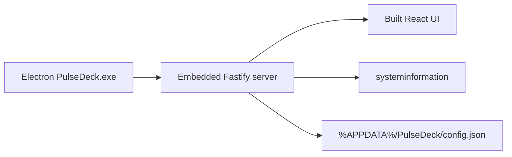

# PulseDeck

**Your Windows PC widget dashboard — as a real desktop app.**

Live CPU, RAM, GPU, disks, network, crypto, stocks, weather, and more in a beautiful drag-and-drop widget grid. Install once, launch from the Start menu. No browser. No terminal.

[](https://github.com/nrzz/pulsedeck/actions/workflows/ci.yml)
[](https://github.com/nrzz/pulsedeck/releases/latest)
[](LICENSE)


<p align="center"></p>

---

## Download & install

**This is the path for most people.** You do not need Node.js or this repository.

1. Open the latest release: **https://github.com/nrzz/pulsedeck/releases/latest**
2. Download **`PulseDeck-Setup-x.x.x.exe`**
3. Run the installer (SmartScreen → **More info** → **Run anyway** if prompted)
4. Launch **PulseDeck** from the Start menu

Closing the board hides it to the system tray. **Ctrl+Alt+P** toggles visibility. Tray click opens the menu (the board stays pinned to the wallpaper by default).

Full install help: [docs/INSTALL.md](docs/INSTALL.md)

---

## Features

| Area               | What you get                                                                                          |
| ------------------ | ----------------------------------------------------------------------------------------------------- |
| **Desktop pin**    | Board attaches to the wallpaper layer (WorkerW) — apps cover it; tray `^` no longer hides the board   |
| **Tray + hotkeys** | Menu on click/right-click; **Ctrl+Alt+P** show/hide, **E** edit, **L** lock; optional float-over-apps |
| **Widget grid**    | Drag, resize, add/remove; search + category Add modal; layout packs (Minimal → Full monitor)          |
| **System**         | CPU, RAM, GPU, disks, I/O, temps, swap, freq, processes, sensors, alerts, battery, uptime             |
| **Network**        | Speeds, Wi‑Fi, IPs, ping, adapters, graph, ports, data usage / bandwidth cap                          |
| **Finance**        | Crypto, stocks, FX exchange, market strip, local portfolio                                            |
| **Extras**         | Clocks, weather, AQI, news tray, calendar, todo, timer, notes, launcher, …                            |
| **News tray**      | Topic chips + suggestion packs + custom RSS; titles/links only (low memory)                           |
| **Customization**  | Themes, accents, density, scale, grid cols, news defaults, export/import JSON                         |

---

## Project structure

```
pulsedeck/
├── apps/
│   ├── desktop/    # Electron shell (window, tray, installer)
│   ├── server/     # Fastify + WebSocket + systeminformation
│   └── web/        # React + Tailwind widget dashboard
├── packages/
│   └── shared/     # Shared types & default layout
├── docs/           # Install guide, widget authoring
└── .github/        # CI + release workflows
```



The installed app embeds the server and UI. Day-to-day you only need the `.exe` from Releases — not `npm run dev` or `npm start`.

---

## Widget catalog

~**47** built-in types. Full reference: [docs/WIDGETS.md](docs/WIDGETS.md) · authoring: [docs/CREATING_WIDGETS.md](docs/CREATING_WIDGETS.md) · internals: [docs/ARCHITECTURE.md](docs/ARCHITECTURE.md)

---

## Contributing

Want to change code or build the installer yourself? See **[CONTRIBUTING.md](CONTRIBUTING.md)** (dev server, `npm run dist`, typecheck, e2e).

## License

MIT — see [LICENSE](LICENSE).
