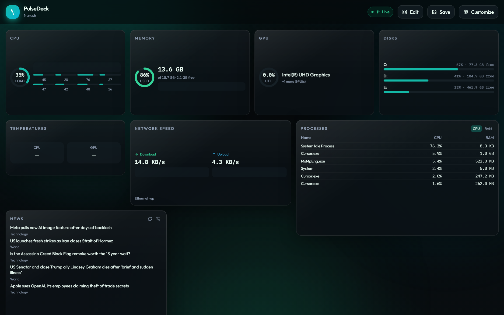
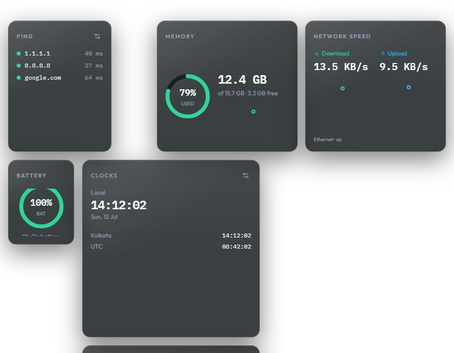
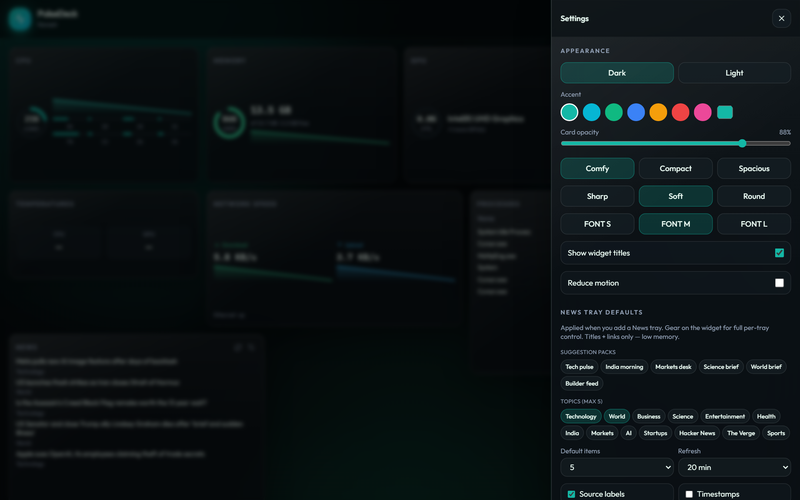
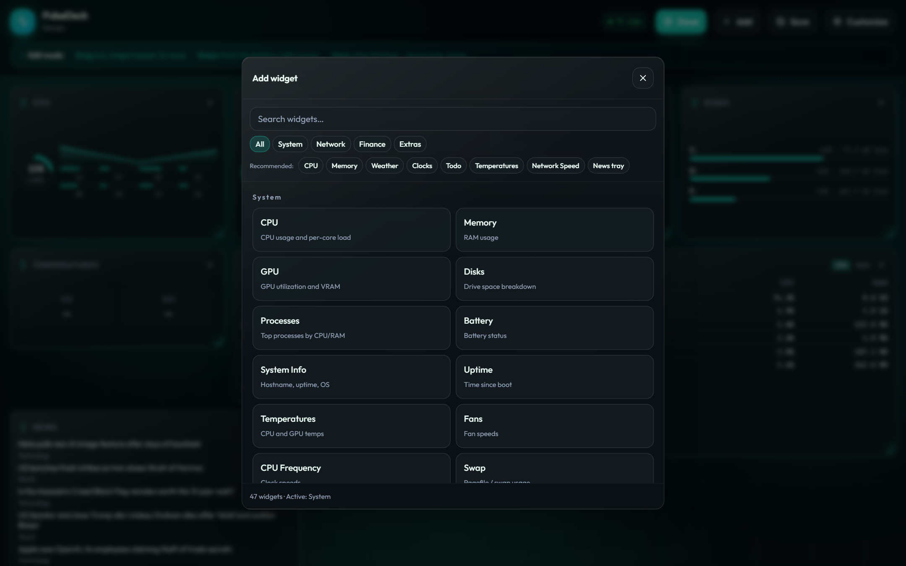

# PulseDeck

**Your desktop widget dashboard — Windows & Linux.**

Live CPU, RAM, GPU, disks, network, crypto, stocks, weather, news, and more on a glass widget board. Install once; no browser, no terminal required.

[](https://github.com/nrzz/pulsedeck/actions/workflows/ci.yml)
[](https://github.com/nrzz/pulsedeck/releases/latest)
[](LICENSE)



<p align="center">
  
</p>

---

## Download (recommended)

**Most people only need the installer.** You do not need Node.js or this repository.

1. Open **[latest release](https://github.com/nrzz/pulsedeck/releases/latest)**
2. Download for your OS:
   - **Windows:** `PulseDeck-Setup-1.1.4.exe`
   - **Linux:** `PulseDeck-1.1.4.AppImage` or `PulseDeck-1.1.4-amd64.deb`
3. Install / run — Windows SmartScreen: **More info → Run anyway**; AppImage: `chmod +x` then run
4. Launch **PulseDeck**

On **Windows** the board pins to the wallpaper layer. On **Linux** use **Behind windows** (best-effort) or **Float over apps**. Closing the window hides to the tray — it does not quit.

Full guide: **[docs/INSTALL.md](docs/INSTALL.md)**

---

## What you get

|                     |                                                                                    |
| ------------------- | ---------------------------------------------------------------------------------- |
| **Desktop shell**   | Tray app; Windows WorkerW pin; Linux behind-windows / float                        |
| **47 widgets**      | System, network, finance, clocks, weather, **News tray**, calendar, todo, timer, … |
| **Launcher**        | Open **URLs and desktop apps** (Cursor, Chrome, …) with presets + Browse           |
| **One-click packs** | Minimal · System · Network · Finance · Focus · Full monitor                        |
| **Customize**       | Themes, accents, density, scale, grid columns, news defaults, export/import        |
| **Tray + hotkeys**  | Click tray for menu · **Ctrl+Alt+P** show/hide · **E** edit · **L** lock           |

<p align="center">
  
  &nbsp;
  
</p>

---

## Everyday use

| Action                      | How                                  |
| --------------------------- | ------------------------------------ |
| Show / hide board           | **Ctrl+Alt+P** or tray → Show / Hide |
| Edit layout (drag / resize) | Toolbar **Edit** or **Ctrl+Alt+E**   |
| Add a widget                | Edit → **Add** (search + categories) |
| Themes & packs              | Toolbar **Customize** or **Presets** |
| Lock (click-through)        | **Ctrl+Alt+L** or tray → Lock        |
| Float above apps            | Tray → **Float over apps**           |
| Quit fully                  | Tray → **Quit**                      |

Config: Windows `%APPDATA%\PulseDeck\config.json` · Linux `~/.config/PulseDeck/config.json`

---

## Widget highlights

~**47** built-in types:

- **System** — CPU, RAM, GPU (dual-GPU util), disks, I/O, temps, swap, frequency, processes, sensors, alerts
- **Network** — speed, Wi‑Fi, IPs, ping, adapters, graph, ports, data usage
- **Finance** — crypto, stocks (**gold/silver** presets), FX, market strip, portfolio
- **Extras** — clocks, weather, AQI, **News tray**, **Launcher (apps + URLs)**, calendar, todo, timer, notes

Full list and settings: **[docs/WIDGETS.md](docs/WIDGETS.md)**

---

## Project structure

```
pulsedeck/
├── apps/
│   ├── desktop/    # Electron shell (Windows + Linux)
│   ├── server/     # Local metrics API + WebSocket
│   └── web/        # React widget dashboard
├── packages/shared # Types, defaults, catalog
└── docs/           # Install + widget reference
```

---

## Contributing / building from source

See **[CONTRIBUTING.md](CONTRIBUTING.md)** for `npm install`, `npm run dist:win` / `dist:linux`, and tests.

Internals: [docs/ARCHITECTURE.md](docs/ARCHITECTURE.md) · Authoring widgets: [docs/CREATING_WIDGETS.md](docs/CREATING_WIDGETS.md)

## License

MIT — see [LICENSE](LICENSE).
