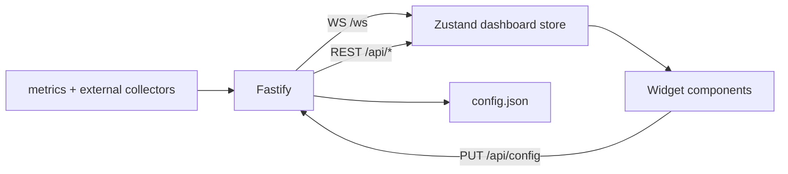

# Architecture

PulseDeck is an npm workspaces monorepo: a React widget UI, a local Fastify metrics server, and an Electron shell that packages them for **Windows and Linux**.

**End users:** you do not need this document — install from [Releases](https://github.com/nrzz/pulsedeck/releases/latest) and see [INSTALL.md](INSTALL.md).

## Monorepo layout

```
pulsedeck/
├── apps/
│   ├── web/        # Vite + React + Tailwind + react-grid-layout + Zustand
│   ├── server/     # Fastify + WebSocket + systeminformation + external APIs
│   └── desktop/    # Electron main/preload, tray, NSIS + AppImage/deb
├── packages/
│   └── shared/     # Types, default config/presets, WIDGET_CATALOG
├── docs/           # Install, architecture, widget SOP
├── scripts/        # E2E (Playwright), server bundle for Electron
└── .github/        # CI + release workflows
```

## Runtime modes

| Mode              | How                                                                                      | Config path                       |
| ----------------- | ---------------------------------------------------------------------------------------- | --------------------------------- |
| **Browser / dev** | `npm run dev` → Vite `:5173` proxies to API `:8787`                                      | `apps/server/data/config.json`    |
| **Desktop**       | Electron boots embedded server on a free `127.0.0.1` port, loads UI with `?shell=widget` | `%APPDATA%\PulseDeck\config.json` |

## Data flow



1. **Collectors** (`apps/server/src/collectors/`) poll CPU/RAM/GPU/disks/network and fetch crypto/stocks/weather/news/ping.
2. **Demand gates** — expensive `disksIO` / `cpuCurrentSpeed` only run when related widgets are on the active preset; news RSS is cached (~12 min) and returns titles/links only.
3. **WebSocket** pushes `metrics`, `ping`, `crypto`, `stocks`, `weather`, `config` messages (news/exchange/AQI often REST-bootstrap on the client).
4. **Zustand** (`apps/web/src/store/dashboard.ts`) holds live state + layout presets; news is keyed per widget id and pruned on remove.
5. **Widgets** subscribe to slices; layout edits call `persistConfig` → `PUT /api/config`.

## Widget plugin model

- Catalog: `WIDGET_CATALOG` in shared (~47 types; docs + Add-widget modal metadata).
- Layout packs: `createNamedPresets()` (Minimal, System, Network, Finance, Focus, Full monitor).
- Runtime registry: `widgetRegistry` maps `type` → React component + default size/settings.
- Layout: `react-grid-layout` (8/12/16 cols via shell). **Never animate `transform` on grid items** — RGL positions via transform.
- Charts: **SVG sparklines only** (no recharts).

See [CREATING_WIDGETS.md](CREATING_WIDGETS.md) and [WIDGETS.md](WIDGETS.md).

## Desktop shell

`apps/desktop/src/main.ts` + `pin-desktop.ts`:

- Frameless, transparent, `skipTaskbar`
- Preload bridge (`window.pulsedeck`) for lock / edit / settings / float / corner IPC
- **Windows:** WorkerW wallpaper attach (`Progman` `0x052C` → `SHELLDLL_DefView` → `SetParent`); fallback `HWND_BOTTOM`
- **Linux:** behind-windows stacking (`wmctrl` on X11 when available) or float-over-apps
- Tray click/right-click: **menu only** + show — never hide on tray interaction
- Hotkeys: **Ctrl+Alt+P** / **E** / **L**
- Default: pinned to desktop; optional float-over-apps
- Widget UI: transparent stage, always-visible Customize/Presets toolbar, compact `desktop` preset

## Packaging

```bash
npm run dist
```

Builds shared → server → web → desktop, bundles server with esbuild into `apps/desktop/dist-electron/server.bundle.cjs`, then electron-builder:

- Windows: `npm run dist:win` → `PulseDeck-Setup-*.exe`
- Linux: `npm run dist:linux` → AppImage + `.deb`

Tag `v*` triggers `.github/workflows/release.yml` (Windows + Linux jobs) to attach all installers to a GitHub Release.

## Security notes

- Server binds **localhost only**.
- No secrets in the repo; optional Finnhub key lives in user config.
- News/clipboard stay local to the machine (clipboard history is never uploaded).
- Report vulnerabilities per [SECURITY.md](../SECURITY.md).
